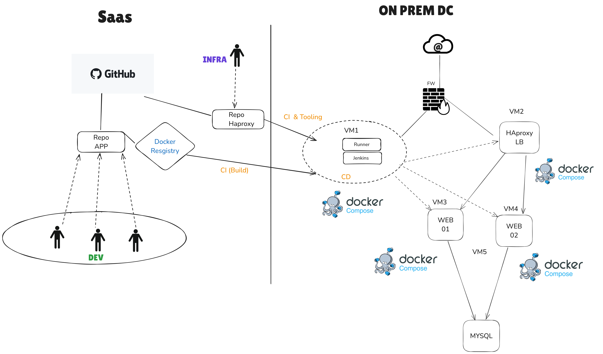

# SVP Infrastructure

## Table of Contents

- [Architecture Overview](#architecture-overview)
- [Prerequisites](#prerequisites)
- [Deployment](#deployment)

## Architecture Overview


## Prerequisites

- 4 VM Debian based
- Ansible >= 2.18.*

## Deployment

In order to deploy every components on each different virtual machines you need them to be correctly routed and reliable to each other.
First of all you need to update the inventory file and set correct values according to your VM setup. I suggest also you to update the HAproxy's configuration file and replace the IP addresses by those of your web application hosting machines


### Install docker and docker-compose on every virtual machines

```bash
ansible-playbook -i inventories/production playbooks/docker.yml
```

### Deploy Jenkins
```bash
ansible-playbook -i inventories/production playbooks/jenkins.yml
```

### Deploy HAproxy
```bash
ansible-playbook -i inventories/production playbooks/haproxy.yml
```

### Deploy mysql
```bash
ansible-playbook -i inventories/production playbooks/mysql.yml
```

### Deploy web applications

A secret for pulling docker image from a private registry is required here, if your images are public you don't need it
```bash
ansible-vault create github_token.yml
```

Then I chose to store the passphrase in a text file that I called ansible-vault-password.txt in the parent directory to avoid typing it.

```bash
ansible-playbook -i inventories/production playbooks/webapp.yml --vault-password-file=../ansible-vault-password.txt
```
